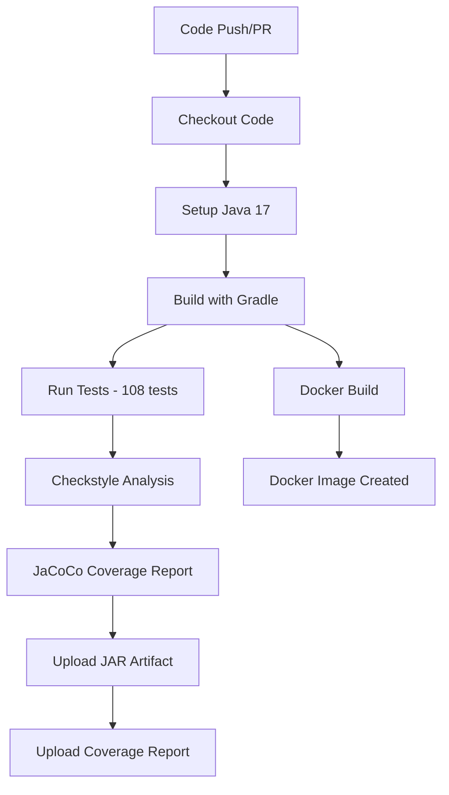

# 🚀 CI/CD Pipeline - Kairos Microservice Test

This document describes the Continuous Integration and Continuous Deployment (CI/CD) pipeline implementation for the Price Service microservice.

## 📋 Overview

The CI/CD pipeline provides fast feedback, ensures code quality, and enables reliable builds. It uses GitHub Actions for automated testing, code quality checks, and artifact generation.

## 🏗️ Pipeline Architecture



## 🛠️ GitHub Actions Workflow

### Pipeline File
`.github/workflows/ci-cd.yml`

### Triggers
- **Push**: Commits to `main` or `master` branches
- **Pull Request**: PRs targeting `main` or `master` branches

### Jobs

#### 1. Build Job
Runs on: `ubuntu-latest`

**Steps:**
1. Checkout code (`actions/checkout@v4`)
2. Set up JDK 17 (Eclipse Temurin with Gradle caching)
3. Make gradlew executable
4. Build with Gradle (includes all tests)
5. Run Checkstyle code quality checks
6. Generate JaCoCo test coverage report
7. Upload JAR artifact (`build/libs/*.jar`)
8. Upload coverage report HTML

#### 2. Docker Job
Runs on: `ubuntu-latest`
Depends on: `build` job completion

**Steps:**
1. Checkout code
2. Build Docker image (`price-service:latest`)

### Pipeline Duration
- **Build Job**: ~40-60 seconds
- **Docker Job**: ~30-45 seconds
- **Total**: ~1.5-2 minutes

## 🧪 Testing Strategy

### Test Execution
All 108 tests run as part of the `./gradlew build` command:

```bash
# Run all tests (executed in pipeline)
./gradlew test

# Run specific test class
./gradlew test --tests "PriceControllerTest"

# Run tests by pattern
./gradlew test --tests "*IntegrationTest"
./gradlew test --tests "*SecurityTest"
```

### Test Coverage
- **Total Tests**: 108 (all passing)
- **Coverage**: 93% line coverage
- **Test Categories**:
  - Unit Tests (Domain, Application, Infrastructure)
  - Integration Tests (Database, Security, Circuit Breaker)
  - Performance Tests

### Coverage Reporting
```bash
# Generate coverage report (executed in pipeline)
./gradlew jacocoTestReport

# View report locally
open build/reports/jacoco/test/html/index.html
```

## 🛡️ Code Quality Gates

### Checkstyle
Enforces Google Java Style Guide compliance:

```bash
# Run Checkstyle (executed in pipeline)
./gradlew checkstyleMain

# Check test code style
./gradlew checkstyleTest

# View reports
open build/reports/checkstyle/main.html
```

**Configuration**: `config/checkstyle/checkstyle.xml`

### Spotless Code Formatting
Automated code formatting with Google Java Format:

```bash
# Check formatting (recommended for CI/CD)
./gradlew spotlessCheck

# Auto-fix formatting issues
./gradlew spotlessApply
```

**Features**:
- Google Java Format 1.19.2
- Import ordering: java → jakarta → javax → org → com
- Removes unused imports
- Ensures newline at EOF

### Code Quality Metrics

| Metric | Target | Current |
|--------|--------|---------|
| **Test Coverage** | ≥ 80% | 93% ✅ |
| **Test Success Rate** | 100% | 100% ✅ |
| **Checkstyle Violations** | 0 | 0 ✅ |
| **Build Time** | < 2min | ~1min ✅ |

## 📦 Artifacts

### 1. JAR Artifact
- **Name**: `price-service-jar`
- **Location**: `build/libs/*.jar`
- **Retention**: 90 days (GitHub default)
- **Usage**: Deployable application JAR

### 2. Coverage Report
- **Name**: `jacoco-report`
- **Location**: `build/reports/jacoco/test/html/`
- **Retention**: 90 days
- **Usage**: Code coverage analysis

## 🐳 Docker Build

### Dockerfile
Multi-stage Docker build for optimized image:

```dockerfile
FROM eclipse-temurin:17-jdk-alpine AS build
# Build stage

FROM eclipse-temurin:17-jre-alpine
# Runtime stage with minimal footprint
```

### Build Command
```bash
# Manual build (pipeline uses this)
docker build -t price-service:latest .

# Run container
docker run -p 8080:8080 \
  -e APP_SECURITY_USER=admin \
  -e APP_SECURITY_PASSWORD=secret \
  price-service:latest
```

## 🔧 Local Development Workflow

### Before Committing

```bash
# 1. Format code
./gradlew spotlessApply

# 2. Run tests
./gradlew test

# 3. Check style
./gradlew checkstyleMain checkstyleTest

# 4. Generate coverage report
./gradlew jacocoTestReport

# 5. Full build (simulates CI)
./gradlew clean build
```

### Complete CI Simulation

```bash
# Run the full pipeline locally
./gradlew clean build checkstyleMain jacocoTestReport

# Build Docker image
docker build -t price-service:latest .
```

## 📊 Pipeline Stages Breakdown

### Stage 1: Environment Setup (10-15s)
- Checkout repository
- Set up Java 17 with Gradle caching
- Make gradlew executable

### Stage 2: Build & Test (40-50s)
- Compile source code
- Compile test code
- Execute all 108 tests
- Package JAR file

### Stage 3: Quality Analysis (5-10s)
- Run Checkstyle on main source
- Generate JaCoCo coverage report
- Validate code quality standards

### Stage 4: Artifact Upload (5-10s)
- Upload application JAR
- Upload coverage HTML report

### Stage 5: Docker Build (30-40s)
- Build Docker image
- Tag as `price-service:latest`

## 🚀 Deployment Readiness

### Pre-Deployment Checklist
- ✅ All 108 tests passing
- ✅ Code coverage ≥ 93%
- ✅ Checkstyle: 0 violations
- ✅ Security tests passing
- ✅ Docker image builds successfully

### Environment Variables Required

| Variable | Default | Production |
|----------|---------|------------|
| `SERVER_PORT` | 8080 | Configure as needed |
| `TESTJAVA_DB_USERNAME` | sa | Use secrets |
| `TESTJAVA_DB_PASSWORD` | password | Use secrets |
| `APP_SECURITY_USER` | user | Use secrets |
| `APP_SECURITY_PASSWORD` | password | Use secrets |

### Kubernetes Deployment

```bash
# Update secrets first (NEVER commit real secrets!)
kubectl apply -f k8s/secret.yaml

# Deploy application
kubectl apply -f k8s/configmap.yaml
kubectl apply -f k8s/deployment.yaml
kubectl apply -f k8s/service.yaml
kubectl apply -f k8s/hpa.yaml

# Verify deployment
kubectl get pods -l app=price-service
kubectl logs -l app=price-service -f
```

## 🔍 Monitoring CI/CD

### GitHub Actions Interface

1. **Actions Tab**: View all workflow runs
2. **Pull Requests**: See checks status
3. **Branches**: View protection rules
4. **Settings → Actions**: Configure workflow permissions

### Workflow Status Badge

Add to README.md:
```markdown
[](https://github.com/YOUR_ORG/kairos-microservicetest/actions)
```

## 🔧 Troubleshooting

### Pipeline Failures

#### 1. Test Failures

```bash
# View test reports locally
./gradlew test
open build/reports/tests/test/index.html

# Run specific failing test
./gradlew test --tests "FailingTestClass"

# Run with more logging
./gradlew test --info
```

#### 2. Checkstyle Violations

```bash
# Run Checkstyle locally
./gradlew checkstyleMain

# View violations
open build/reports/checkstyle/main.html

# Auto-fix formatting (may resolve some issues)
./gradlew spotlessApply
```

#### 3. Coverage Below Threshold

```bash
# Generate report
./gradlew jacocoTestReport

# View report
open build/reports/jacoco/test/html/index.html

# Check which classes need coverage
# Look for red/yellow indicators
```

#### 4. Docker Build Failures

```bash
# Build locally to see errors
docker build -t price-service:latest .

# Check Dockerfile syntax
docker build --no-cache -t price-service:latest .

# Verify base image
docker pull eclipse-temurin:17-jre-alpine
```

### Common Issues

| Issue | Solution |
|-------|----------|
| **Gradle daemon issues** | Run `./gradlew --stop` |
| **Test timeout** | Increase timeout in test configuration |
| **Out of memory** | Increase Gradle heap: `GRADLE_OPTS=-Xmx2048m` |
| **Checkstyle fails** | Run `./gradlew spotlessApply` first |
| **Docker build fails** | Check Dockerfile and clean build artifacts |

## 📈 Pipeline Optimization

### Current Performance
- Build: ~40-60s
- Docker: ~30-40s
- Total: ~1.5-2min

### Optimization Strategies
1. **Gradle Caching**: GitHub Actions caches Gradle dependencies
2. **Parallel Execution**: Tests run in parallel where possible
3. **Docker Layer Caching**: Multi-stage build optimizes layers
4. **Test Optimization**: Fast unit tests run first

### Future Improvements
- [ ] Add security scanning (OWASP Dependency Check)
- [ ] Add SonarQube integration for code quality metrics
- [ ] Add automated deployment to staging environment
- [ ] Add performance/load testing stage
- [ ] Add release automation with semantic versioning
- [ ] Add Slack/Teams notifications

## 📚 Commands Reference

### Development Commands

```bash
# Build & Test
./gradlew build                    # Full build with tests
./gradlew test                     # Run all tests
./gradlew clean build              # Clean build

# Code Quality
./gradlew checkstyleMain           # Check main code style
./gradlew checkstyleTest           # Check test code style
./gradlew spotlessCheck            # Check formatting
./gradlew spotlessApply            # Auto-fix formatting
./gradlew jacocoTestReport         # Generate coverage

# Running Application
./gradlew bootRun                  # Run locally
./gradlew bootRun --args='--server.port=8081'  # Custom port
```

### Docker Commands

```bash
# Build
docker build -t price-service:latest .
docker build -t price-service:v0.2.0 .

# Run
docker run -p 8080:8080 price-service:latest
docker run -p 8080:8080 \
  -e APP_SECURITY_USER=admin \
  -e APP_SECURITY_PASSWORD=secret \
  price-service:latest

# Verify
docker ps
docker logs <container-id>
curl -u user:password http://localhost:8080/api/prices?applicationDate=2020-06-14-16:00:00&productId=35455&brandId=1
```

### Kubernetes Commands

```bash
# Deploy
kubectl apply -f k8s/

# Verify
kubectl get all -l app=price-service
kubectl describe pod -l app=price-service
kubectl logs -l app=price-service -f

# Debug
kubectl exec -it <pod-name> -- /bin/sh
kubectl port-forward <pod-name> 8080:8080

# Scale
kubectl scale deployment price-service --replicas=3

# Delete
kubectl delete -f k8s/
```

## 🔐 Security

### Pipeline Security

- **Secrets Management**: Use GitHub Secrets for sensitive data
- **Permissions**: `contents: read` (minimal permissions)
- **Dependencies**: Gradle dependency verification enabled
- **Docker**: Non-root user, minimal base image

### Adding Secrets

```bash
# GitHub Settings → Secrets and variables → Actions
# Add repository secrets:
- APP_SECURITY_PASSWORD
- DOCKER_REGISTRY_TOKEN
- (future) SONAR_TOKEN
```

## 📞 Support & Resources

### Documentation
- **Architecture**: See [CLAUDE.md](CLAUDE.md)
- **API Documentation**: Available at `/swagger-ui.html` when running
- **Changelog**: See [CHANGELOG.md](CHANGELOG.md)

### Getting Help
- Review GitHub Actions workflow runs
- Check build logs and test reports
- Review this documentation
- Open GitHub issue for persistent problems

## 🎯 Best Practices

### For Developers

1. **Always run tests locally** before pushing
2. **Format code** with Spotless before committing
3. **Check Checkstyle** to avoid pipeline failures
4. **Review coverage reports** to maintain quality
5. **Test Docker builds** if changing dependencies

### For CI/CD Maintenance

1. **Monitor pipeline duration** - aim to keep under 2 minutes
2. **Review failing tests** immediately
3. **Update dependencies** regularly
4. **Keep documentation current**
5. **Add tests** for new features

---

**Last Updated**: 2026-01-22
**Version**: 0.2.0
**Pipeline**: GitHub Actions
**Status**: ✅ Active and Maintained
